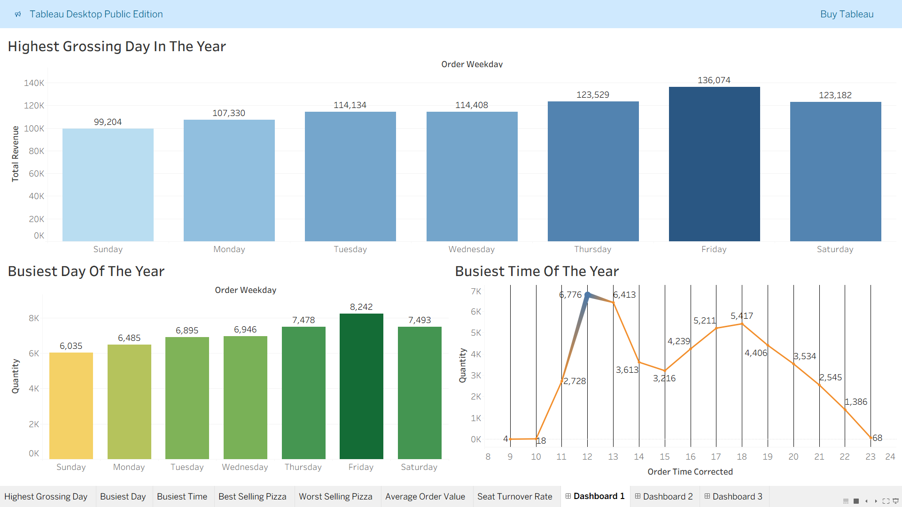
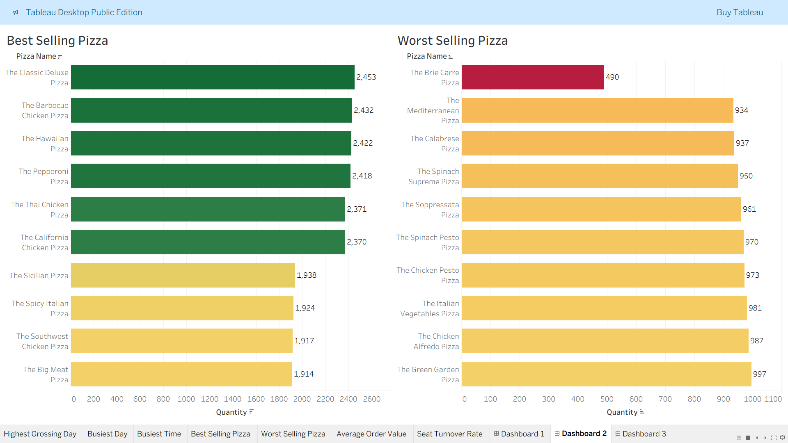
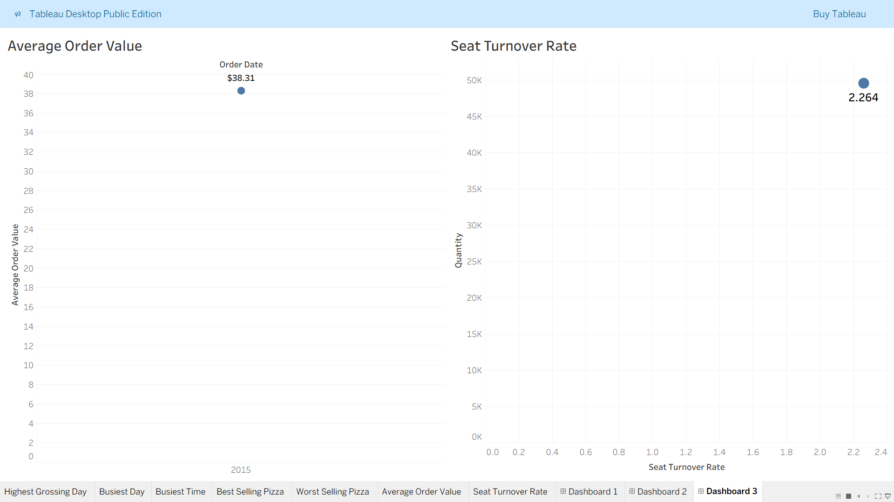

### pizza_project_1_intership
It is my Data Analytics Internship Project Number 1 titled "pizza sales" in UNIFIED MENTOR.
# 🍕 Plato’s Pizza Data Analysis – Project Scope & Objectives

---

## 📌 Project Title  
**The Pizza Challenge – Sales & Operations Analysis for Plato’s Pizza**

---

## 🎯 Objective  
Analyze one year of transactional data from Plato’s Pizza to uncover trends in pizza sales, customer behavior, and restaurant capacity usage. The goal is to provide actionable insights that help improve revenue, operational efficiency, and customer experience.

---

## 📦 Scope of Analysis (In-Scope)
- Identify busiest days and times of the week  
- Analyze pizza sales by type, size, and quantity  
- Determine peak hours and pizza demand during those times  
- Calculate average order value (AOV)  
- Estimate seating/table utilization based on customer volume  
- Explore seasonal or monthly sales trends (if applicable)

---

## 🚫 Out of Scope (Excluded from This Project)
- Ingredient inventory and cost optimization  
- Delivery logistics or time tracking  
- Employee performance or shift scheduling  
- Customer demographic profiling (if not available in data)

---

## ❓ Key Questions to Answer
1. What days and times do we tend to be busiest?  
2. How many pizzas are we making during peak periods?  
3. What are our best and worst-selling pizzas?  
4. What’s our average order value?  
5. How well are we utilizing our seating capacity?  
6. Are there seasonal or monthly trends in sales?  
7. Are there opportunities to increase sales through promotions or combos?

---

## 📏 Key Metrics to Track
- Number of orders  
- Quantity of pizzas sold  
- Revenue per order  
- Pizza type/size sales breakdown  
- Timestamps (for time-based analysis)  
- Estimated customer count (for seating analysis)  
- Table and seat utilization (15 tables, 60 seats)

---

## 📁 Notes
- Data covers one year of transactions  
- Assumptions (e.g., number of people per order) may be used if customer count is not provided  
- Data cleaning will be the next step before analysis begins

# 📊 Key KPIs for Pizza Sales Analysis (with SQL Queries)
### Note: All screenshots of result in 'INT Project 1 - Plato’s Pizza Data Analysis Report' file

## 1. 🧾 Total Revenue
Definition: Total money earned from all orders  
 Formula: SUM(total_price)  
```sql
SELECT 
round(SUM(total_price),2) AS total_revenue
FROM pizza_sales;
```

## 2. 💰 Average Order Value (AOV)
Definition: Average revenue generated per order  
 Formula: SUM(total_price) / COUNT(DISTINCT order_id)
```sql
SELECT 
ROUND(SUM(total_price) * 1.0 / COUNT(DISTINCT order_id), 2) AS avg_order_value
FROM pizza_sales;
```


## 3. 🍕 Total Pizzas Sold
Definition: Total number of pizza units sold  
 Formula: SUM(quantity)
```sql
SELECT 
  SUM(quantity) AS total_pizzas_sold
FROM pizza_sales;
```

## 4. 🏆 Best-Selling Pizzas(Top 5)
Definition: Pizzas with the highest quantity sold  
 Formula: SUM(quantity) grouped by pizza_name
```sql
SELECT TOP 5
  pizza_name,
  SUM(quantity) AS total_sold
FROM pizza_sales
GROUP BY pizza_name
ORDER BY total_sold DESC;
```

## 5. ❌ Worst-Selling Pizzas(Bottom 5)
Definition: Pizzas with the lowest quantity sold
```sql
SELECT TOP 5
  pizza_name,
  SUM(quantity) AS total_sold
FROM pizza_sales
GROUP BY pizza_name
ORDER BY total_sold ASC;
```

## 6. ⏰ Peak Order Hour(TOP 5)
Definition: The hour of the day when most sales occur  
 Formula: Group by HOUR(order_time)
```sql
SELECT TOP 5
  DATEPART(HOUR, order_time) AS order_hour,
  round(SUM(total_price),2) AS hourly_revenue
FROM pizza_sales
GROUP BY DATEPART(HOUR, order_time)
ORDER BY hourly_revenue DESC;
```

## 7. 📅 Busiest Day of the Week
Definition: A Day with the highest total revenue  
 Formula: Group by weekday name
```sql
SELECT 
  DATENAME(WEEKDAY, CAST(order_date AS DATE)) AS day_name,
  round(SUM(total_price),2) AS daily_revenue
FROM pizza_sales
GROUP BY DATENAME(WEEKDAY, CAST(order_date AS DATE))
ORDER BY daily_revenue DESC;
```

## 8. 📐 Revenue by Pizza Size
Definition: Total revenue earned by each pizza size  
```sql
SELECT 
  pizza_size,
  round(SUM(total_price),2) AS revenue
FROM pizza_sales
GROUP BY pizza_size
ORDER BY revenue DESC;
```

## 9. 🥦 Revenue by Pizza Category
Definition: Revenue earned by Classic, Veggie, Supreme, and Chicken  
```sql
SELECT 
  pizza_category,
  SUM(total_price) AS revenue
FROM pizza_sales
GROUP BY pizza_category
ORDER BY revenue DESC;
```

## 10. 🪑 Estimated Seat Utilisation Rate
Customer Estimation Logic
We analysed 21,350 unique orders and 48,620 pizza line items. On average, each order consists of 2.28 pizza items.
Therefore, we estimate customer count based on the number of order_details_id, assuming each pizza item represents one person (≈ 1 pizza per person).
This results in an estimated 48,620 customers served over the year.
```sql
SELECT 
  ROUND(CAST(48620 AS FLOAT)/60, 2) AS total_full_seat_cycles,
  ROUND(CAST(48620 AS FLOAT) / 60 / 365, 2) AS avg_full_seat_cycles_per_day,
  ROUND(CAST(48620 AS FLOAT) / (365 * 60) * 100, 2) AS avg_daily_seat_utilization_percent
```
Seating Utilisation Insight:
Over the years, Plato’s Pizza served approximately 48,620 customers.
Given 60 seats and 365 days, this equates to a daily average seating utilisation of 222%, meaning each seat is used 2.2 times daily.
This reflects a healthy table turnover, especially during peak hours.

Initially, we used order_details_id as a proxy for customer count, assuming each unique pizza configuration was intended for a separate person.
However, for more accurate seating capacity analysis, we use SUM(quantity) to represent estimated customers, under the assumption that 1 pizza ≈ 1 customer. This provides a closer match to real-world dine-in behavior and accounts for actual volume of items served.  

#### Note: Screenshots of individual charts given in Data Analysis Report docx file.

This makes Seat Turnover Rate 2.264 times per day. 
Note:- We can make the assumption that 1 table is occupied by 4 seats.

## 11. Busiest Day of the Year 
As seen in Tableau Chart Busiest Day is Friday

#### Note: Screenshots of individual charts given in Data Analysis Report docx file.

During this day, the highest of 8242 pizzas are made in a year.

## 12. Busiest Time of the Year 
As seen in Tableau Chart Busiest Time is 12:00 PM.

#### Note: Screenshots of individual charts given in Data Analysis Report docx file.

During this time, the highest of 6776 pizzas are made in a year.
Pizzas made at 12 PM on Fridays only, using SQL
```sql
SELECT SUM(quantity) AS pizzas_at_noon_on_friday
FROM pizza_data.dbo.pizza_sales
WHERE DATEPART(HOUR, order_time) = 12
  AND DATENAME(WEEKDAY, order_date) = 'Friday';
```


# Data Cleaning

1. Changed order_details_id, order_id, quantity, unit_price and total_price to their respective number formats(int and float) from default string formats.  
2. Changed order_date and order_time to respective date and time format from string format.  
3. Trimmed all cells in a different sheet, applying a formula:  


#### =ARRAYFORMULA(TRIM(pizza_sales!A1:L48621))

# Tableau Dashboards

## Dashboard 1
  

## Dashboard 2


## Dashboard 3


## 📌 Key Insights 

* 🔥 **Friday** is the busiest day in terms of both revenue and orders.
* ⏰ **12 PM** is the peak hour, with the highest pizza production.
* 🍕 The most popular pizza is **The Classic Deluxe Pizza**, while the least sold is **The Brie Carre Pizza**.
* 💺 Average seat turnover is **2.264/day**, indicating high efficiency.
* 💰 Average Order Value (AOV) is **\$38.31**, with variations by day.
* 🍕 During peak hour (12 PM), **6,776 pizzas** are made across the year — the highest volume for any hour.
* 🍕 During peak day (Friday), **8,242 pizzas** are made across the year — the highest volume for any day.
* 🍕 During peak hour (12 PM) and peak day(Friday) simultaneously, **1,101 pizzas** are made across the year.

## ✅ Recommendations

- Launch Friday lunch combo deals to capture high traffic
- Optimize kitchen staffing at 12 PM peak
- Explore upsell opportunities on lower-performing pizzas

## 📋 Business Questions – Answered

Below are the business questions posed by Plato’s Pizza and the sections where they are answered:

1. **What days and times do we tend to be busiest?**  
   → Answered in [Key Insights – Bullet 1 & 2](#key-insights)

2. **How many pizzas are we making during peak periods?**  
   → Answered in [Key Insights – Bullet 6,7 and 8](#key-insights)

3. **What are our best and worst-selling pizzas?**  
   → Answered in [Key Insights – Bullet 3](#key-insights)

4. **What’s our average order value (AOV)?**  
   → Answered in [Key Insights – Bullet 5](#key-insights)

5. **How well are we utilizing our seating capacity?**  
   → Answered in [Key Insights – Bullet 4](#key-insights)

6. **Are there opportunities to increase sales through promotions or combos?**  
   → Answered in [Recommendations](#recommendations) _(if you added this section)_


  
